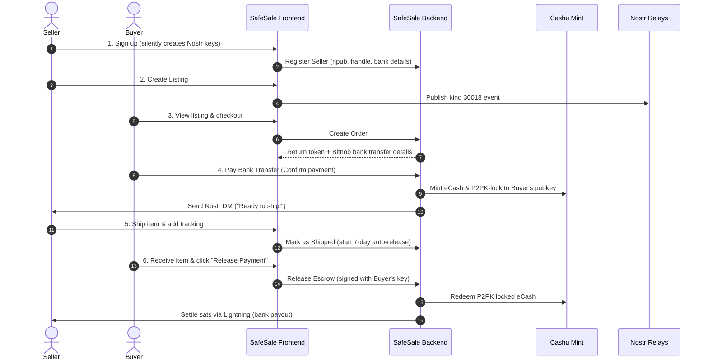

# 🛡️ SafeSale

> **Trustless, Zero-Custody Escrow for Social-Commerce in Nigeria — Works Wherever You Can Paste a Link.**

SafeSale is a decentralized escrow layer designed for Instagram, WhatsApp, TikTok, X, and Telegram micro-sellers in West Africa. It enables zero-trust peer-to-peer commerce without relying on centralized custodians who can freeze accounts or seize funds. 

By marrying the **Nostr protocol** (for identity and reputational state) with **Cashu ecash** (for cryptographic escrow locking), SafeSale ensures that buyers only release funds when they receive their items, while sellers are guaranteed payment is locked and waiting.

This project is submitted for **Hack4Freedom**.

---

## 📸 The Problem: Zero-Trust Social Commerce

In Nigeria alone, millions of transactions happen weekly via DMs on Instagram and WhatsApp between parties who do not know each other. 
* **Buyers** live in fear of "pay-before-delivery" scams (where sellers disappear after receiving bank transfers).
* **Sellers** live in fear of "delivery-before-payment" theft (where buyers refuse to pay or claim items never arrived).
* **Centralized escrow platforms** charge massive fees and act as custodians, meaning they can freeze user funds, block accounts, and require extensive intrusive KYC that excludes informal merchants.

---

## 💡 The Solution: Cryptographic Escrow

SafeSale operates as a decentralized escrow wedge:
1. **Zero Custodian:** SafeSale does not hold your funds. Money is locked into a **Cashu ecash token** on a federated mint. SafeSale cannot freeze, seize, or intercept these funds.
2. **Buyer Sovereign Control:** The Cashu token is P2PK-locked (NUT-11) to a one-time Nostr public key generated locally in the buyer's browser at checkout. **Only a signature from the buyer's private key can unlock and redeem the funds.**
3. **Open Identity & Reputation:** Sellers register using their own Nostr identities. Storefront listings are published directly as Nostr `kind 30018` events. Reputation is censorship-resistant, self-owned, and globally portable.

---

## 🔄 How it Works (Step-by-Step)



1. **Onboarding:** The seller signs up in under 30 seconds. A Nostr keypair is generated locally in their browser. This private key (`nsec`) is their storefront identity—no passwords, no email registration.
2. **Listing:** The seller creates a product listing. The frontend uploads photos to a Nostr Blossom server and publishes a `kind 30018` listing event.
3. **Checkout:** The seller shares their shop link (e.g. `safesale.app/buy/listing-id`). The buyer inputs their delivery info. A one-time keypair is generated in the buyer's browser to serve as the cryptographic escrow lock.
4. **Escrow Lock:** The buyer initiates bank transfer payment (mocked via Bitnob). Once verified, the backend mints a Cashu ecash token worth the sat equivalent of the purchase price and cryptographically locks it (NUT-11 P2PK) to the buyer's public key. The seller receives a secure Nostr DM: *"₦21,900 locked in escrow. Safe to ship!"*
5. **Shipping:** The seller ships the item, uploads tracking info, and the backend notifies the buyer.
6. **Release / Payout:** When the item arrives, the buyer clicks "Release Payment". Their browser signs the token release using the one-time private key stored locally. The backend redeems the token and settles the sats directly to the seller via Lightning.
7. **Dispute Resolution:** If a dispute arises, the token remains locked. A SafeSale mediator reviews evidence uploaded by both parties and publishes a signed Nostr `kind 33889` dispute resolution event, ensuring absolute transparency.

---

## 📂 Repository Structure

The SafeSale repository is structured as a monorepo containing both the frontend client and the backend API server:

```
safesale/
├── README.md                  # This central monorepo guide
├── safesale-frontend/         # Client Application (React + Vite + TypeScript)
│   ├── src/                   # Components, Pages, Hooks, & Client API
│   ├── package.json
│   ├── PRD.md                 # Product Requirements Document
│   └── NIP.md                 # Nostr Implementation Plan details
└── safesale-backend/
    └── safe-sales-backend/    # Escrow API Service (Fastify + Prisma + PostgreSQL)
        ├── src/               # Express-like routes, Cashu/Nostr services
        ├── prisma/            # Database schema and migrations
        ├── package.json
        └── STATE.md           # Backend system state & verification logs
```

---

## ⚡ Hackathon MVP Scope (Honest Disclosures)

The trustless cryptographic escrow loop (buyer pays → payment locked in Cashu P2PK → seller ships → buyer signs and releases → seller gets paid) is **fully implemented and live** on testnet. 

To ensure a smooth demo for judges, we have documented specifically what is real/live and what has been mocked/deferred:

| Feature | Hack4Freedom Status | Production Target |
|---------|---------------------|-------------------|
| **Cryptographic Escrow** | **Live**. Cashu token minting, P2PK-locking, and signature verification work natively. | Same (Mainnet deployment) |
| **Identity & Relays** | **Live**. Sellers sign up via Nostr, and listings are published to public relays. | Same (Custom relays for faster index) |
| **Buyer Signature** | **Live**. Release requires a cryptographic signature matching the buyer's key. | Same |
| **Bank Transfer Rails** | **Mocked**. Bitnob virtual bank accounts require full business KYC. For the demo, we simulate bank transfers via `confirm-payment`. | Live NUBAN issuance via Bitnob API |
| **Lightning Melt** | **Mocked**. Sats settle on the Cashu testnet mint (`testnut.cashu.space`) on release. | Live Lightning-to-Bank swap to credit Nigerian bank accounts |
| **Disputes UI** | **Live**. Dispute lists and detail views fetch real database order state. | Custom NIP-17 dispute-chat channels |
| **Admin Panel** | **Live UI, Mock Data**. Gated securely by the Mediator NPUB, awaiting full admin route integration. | Fully integrated database resolution actions |

---

## 🛠️ Local Development Setup

To run both the frontend and backend services on your machine:

### Prerequisites
* **Node.js** (v22.0.0 or higher)
* **PostgreSQL** (running locally or hosted)

---

### 1. Backend Setup

1. Navigate to the backend directory:
   ```bash
   cd safesale-backend/safe-sales-backend
   ```
2. Copy the environment template:
   ```bash
   cp .env.example .env
   ```
3. Open `.env` and fill in your database connection string and Nostr identity variables.
4. Install dependencies:
   ```bash
   npm install
   ```
5. Apply database migrations:
   ```bash
   npm run db:migrate
   ```
6. Start the Fastify dev server:
   ```bash
   npm run dev
   ```
   The backend will boot up on `http://localhost:3000`.

---

### 2. Frontend Setup

1. Navigate to the frontend directory:
   ```bash
   cd ../../safesale-frontend
   ```
2. Copy the environment template:
   ```bash
   cp .env.example .env
   ```
3. Open `.env` and verify `VITE_API_URL` points to your local backend (`http://localhost:3000`).
4. Install dependencies:
   ```bash
   npm install
   ```
5. Start the Vite dev server:
   ```bash
   npm run dev
   ```
   The frontend will boot up on `http://localhost:8080` (or `http://localhost:5173`).

---

## 🛡️ Security Features (Built-In)

* **No Password Database**: Since all registration and checkout use Nostr keys, there is zero risk of database password breaches, credential stuffing, or phishing.
* **Cryptographic Sovereignty**: SafeSale never stores or transmits the buyer's one-time private key over HTTP during checkout. All signatures are calculated client-side in the browser.
* **Database Parameterization**: All DB queries use **Prisma ORM**, offering native protection against SQL Injection (SQLi).
* **Environment Validation**: Env variables are parsed and strict-typed with Zod schemas at boot time, throwing errors immediately if any configuration is incorrect.

---

## 👩‍💻 The SafeSale Team

* **Joy** — Backend Architecture, Cashu eCash primitives, and Nostr DM dispatching
* **Mutmahinat** — Frontend Engineering, UI/UX Design, Nostrify Integration, and State Wiring

---

## 🤝 Open Source Contributions & Post-Hackathon Roadmap

SafeSale is built to be a public good. Following the Hack4Freedom submission, we are transitionining SafeSale into a **fully open-source contribution project** to help micro-sellers across the Global South trade safely and sovereignly.

We welcome developers, designers, and security researchers to join us in building the future of zero-trust social commerce!

### 🗺️ Post-Hackathon Roadmap & Contribution Areas

1. **Lightning Network Integration (Phase 9):** Replace testnet Cashu settlements with real-money mainnet Cashu mints and settle payouts to sellers via custom Lightning (LNURL-pay) endpoints.
2. **Robust NIP-98 Authentication:** Refactor backend endpoints with full Nostr signature request verification to block direct object reference (IDOR) vectors.
3. **Decentralized Reputation Systems:** Wire NIP-32 review events to listings and seller storefronts for decentralized trust scores.
4. **NIP-17 Encrypted Dispute Chat:** Build secure, end-to-end encrypted direct messaging between buyers, sellers, and mediators.
5. **Mobile Native Clients:** Wrap the React application into a responsive progressive web app (PWA) and native mobile shells for low-bandwidth environments.

### 💡 How to Contribute
* Review our open issues or check the [`CONTRIBUTING.md`](./safesale-frontend/CONTRIBUTING.md) inside the frontend folder.
* Fork the repository, create a branch (`feature/your-feature`), and open a Pull Request.
* Share your thoughts on Nostr by tagging the creators!

---

## 📄 License

This project is licensed under the MIT License.
